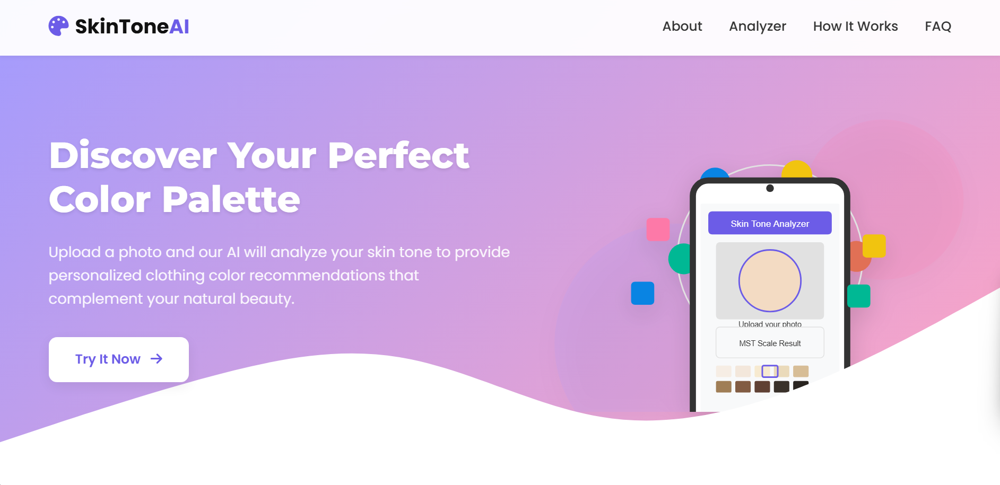

# SkinToneAI - Skin Tone Analyzer

SkinToneAI is a sophisticated web application that analyzes your skin tone using a deep learning model and provides personalized clothing color recommendations based on the Monk Skin Tone (MST) scale.

## Features

- **AI-Powered Skin Tone Analysis**: Upload a photo to detect your skin tone classification on the MST scale
- **Personalized Recommendations**: Get clothing color suggestions that complement your skin tone
- **Modern, Responsive UI**: Beautiful user interface that works across all devices
- **Detailed Visualization**: Interactive MST scale to understand your skin tone classification

## Technology Stack

- **Frontend**: HTML5, CSS3, JavaScript
- **Backend**: Flask (Python)
- **Machine Learning**: TensorFlow, MobileNetV2
- **Data Visualization**: Custom SVG graphics and CSS animations

## Usage

1. **Browse the website** to learn about skin tones and the MST scale
2. **Upload an image** by clicking on the upload area or dragging and dropping a file
3. **Click "Analyze Skin Tone"** to process your image
4. **View results** showing your skin tone classification on the MST scale
5. **Explore recommendations** for clothing colors that complement your skin tone

## Model Information

The skin tone classifier uses a MobileNetV2 architecture that has been fine-tuned on a dataset of diverse skin tones. The model classifies skin tones according to the Monk Skin Tone (MST) Scale, which provides a more inclusive representation of human skin diversity than traditional scales.

## Acknowledgements

- The Monk Skin Tone Scale developed by Dr. Ellis Monk
- TensorFlow and Keras for making deep learning accessible
- Flask for the simple and powerful web framework